# My-E-commerce
This is a E-Commerce app.

 Splash	|	Login	|	Register	|	ForgotPassword	
:----:|:----:|:----:|:----:
  |  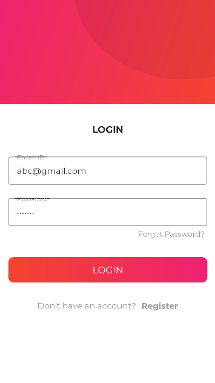 |  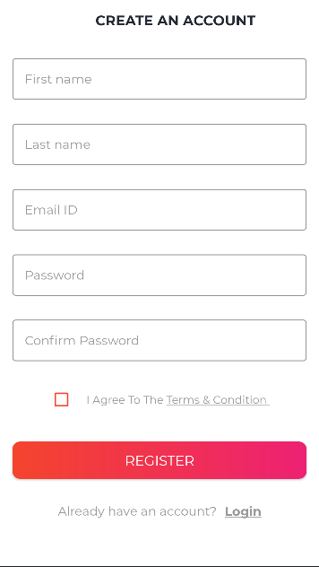 |  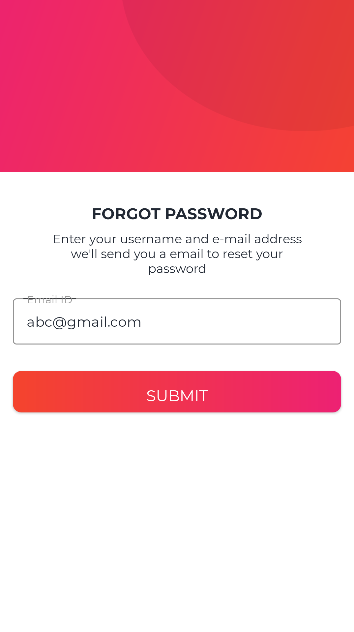 

 Dashboard	|	Products	|	SoldProduct	|	Orders	
:----:|:----:|:----:|:----:
 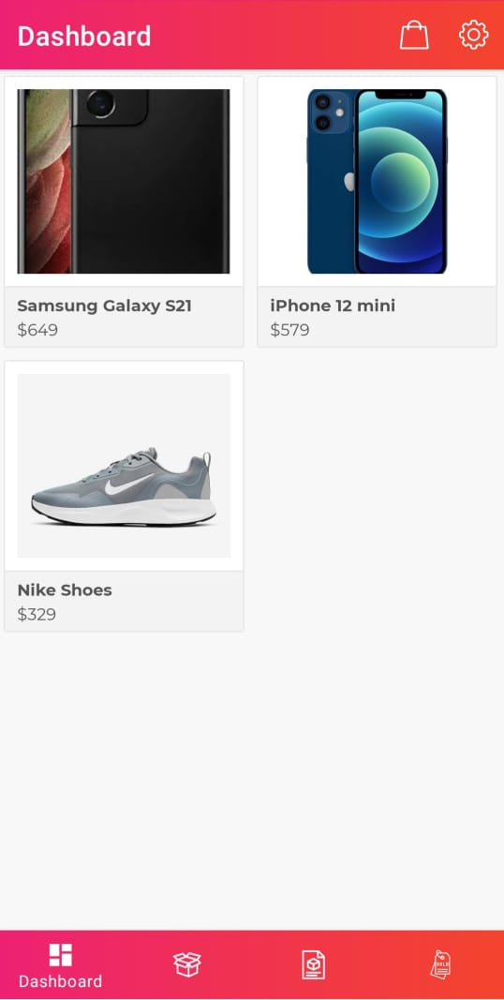 |  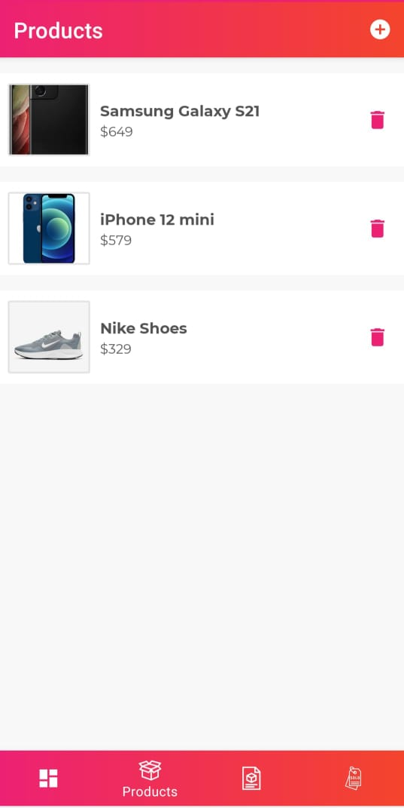 |  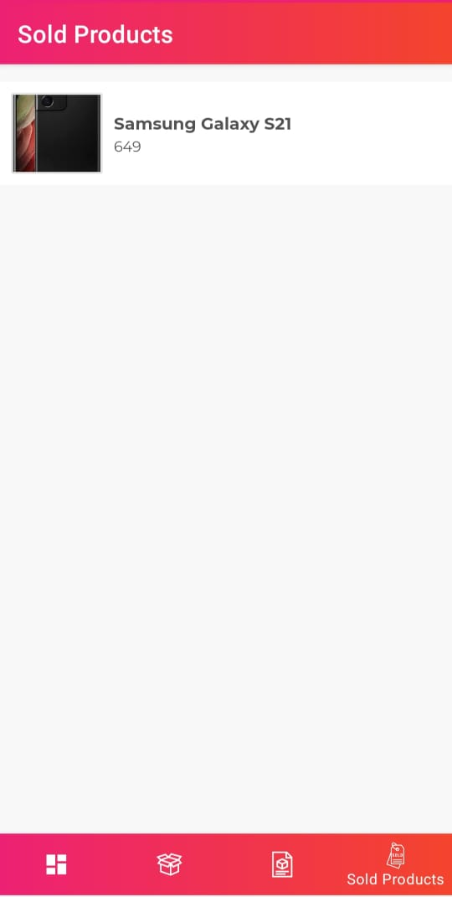 |  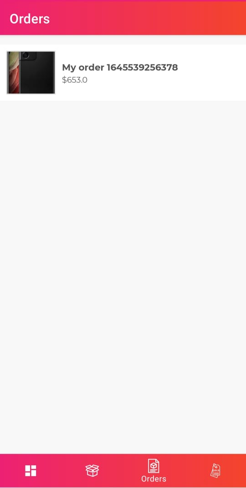 

 ProductDetails	|	MyCart	|	Checkout	|	MyOrderDetails	
:----:|:----:|:----:|:----:
 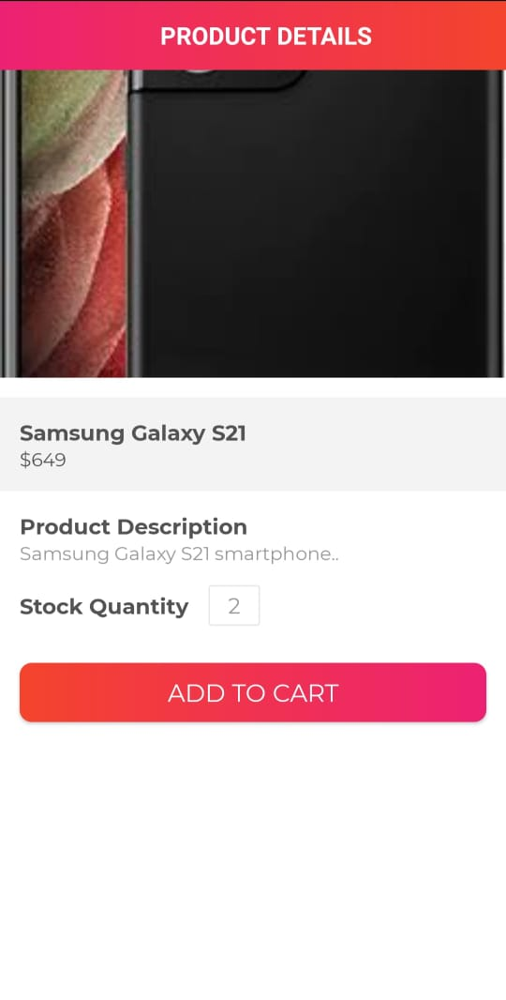 |  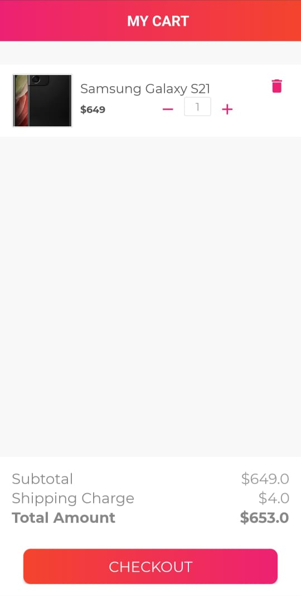 |  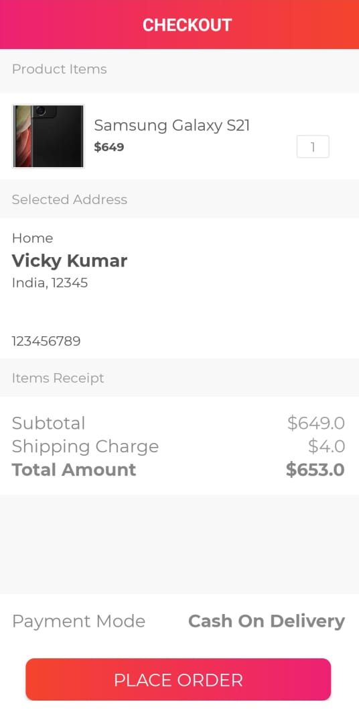 |  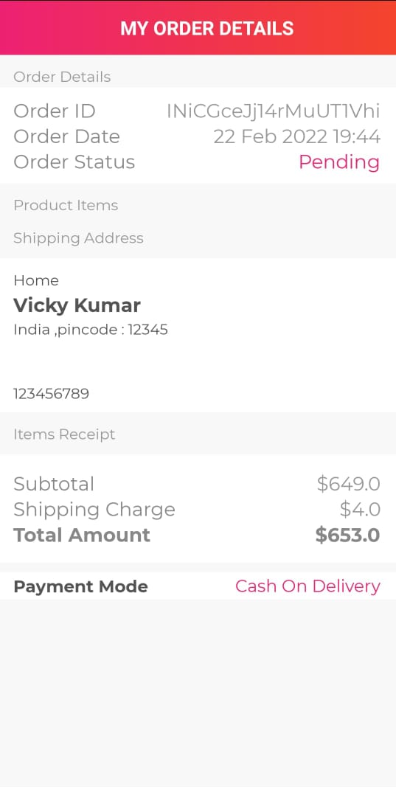

 
 SettingsActivity	|	
:----:|
 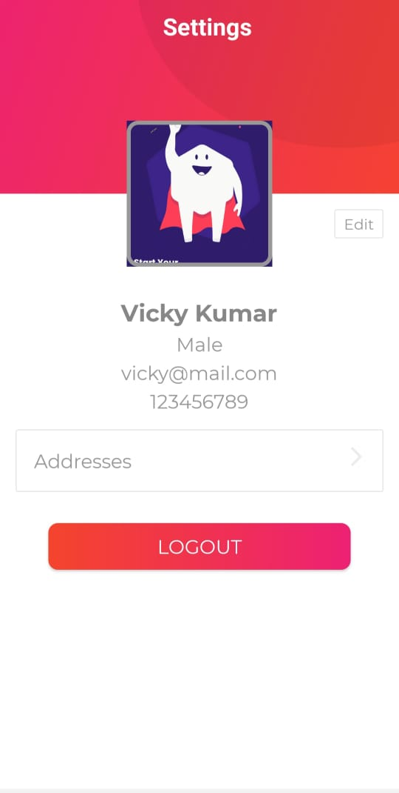 | 

